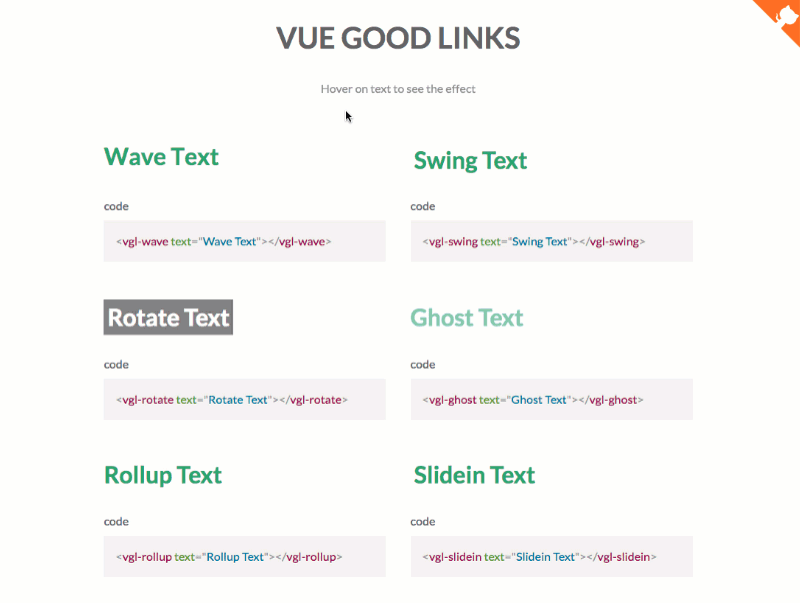

# vue-good-links

<!--- [](https://www.npmjs.com/package/vue-good-links) --->
[](https://github.com/xaksis/vue-good-links/releases)
[](https://github.com/xaksis/vue-good-links/blob/master/LICENSE)
<!--- [](https://www.jsdelivr.com/package/npm/vue-good-links) --->

An easy to use link/text hover effect library for VueJS


## Live Demo

[vue-good-links Demo](https://xaksis.github.io/vue-good-links/)

If you endup using and liking vue-good-links, consider spreading the joy :)

<a href="https://www.buymeacoffee.com/68BUXR1d9" target="_blank"></a>

## Follow the project progress live
[Vue-good-links Project](https://timerbit.com/#/public/29XFY0N7Rw9uCBsujiTM)

### Installing

Install with npm:
```
npm install --save vue-good-links
```

### Usage

import directly into components:

```vue
<template>
  <div>
    this is my <vgl-swing text="fancy text"></vgl-swing>
  </div>
</template>

<script>
import {VglSwing} from 'vue-good-links';

export default {
  components: {
    'vgl-swing': VglSwing,
  },
};
</script>
```

or use globally
```js
import VueGoodLinks from 'vue-good-links';

// import the styles 
import 'vue-good-links/dist/vue-good-links.css';

Vue.use(VueGoodLinks);
```

### List of Effects

- VglWave
- VglRollup
- VglSlidein
- VglGhost
- VglSwing
- VglRotate

### Component Options
<table>
  <thead>
    <tr>
      <th>Option</th>
      <th>Description</th>
      <th>Type, Example</th>
    </tr>
  </thead>
  <tbody>
    <tr>
      <td>originalSpanStyle</td>
      <td>css styles for standing text span. (applies to all but VglWave)</td>
      <td>
<pre lang="vue">
&lt;vgl-swing :originalSpanStyle=&quot;{color: 'blue'}&quot; text=&quot;fancy!&quot;&gt;&lt;/vgl-swing&gt;
</pre>
      </td>
    </tr>
    <tr>
      <td>hoverSpanStyle</td>
      <td>css styles for hovering text span. (applies to all but VglWave)</td>
      <td>
<pre lang="vue">
&lt;vgl-swing :hoverSpanStyle=&quot;{color: 'blue'}&quot; text=&quot;fancy!&quot;&gt;&lt;/vgl-swing&gt;
</pre>
      </td>
    </tr>
  <tbody>
</table>

## License

This project is licensed under the MIT License - see the [LICENSE.md](LICENSE) file for details

>inspiration for effects taken from [Tympanus](https://tympanus.net/Development/CreativeLinkEffects/)
